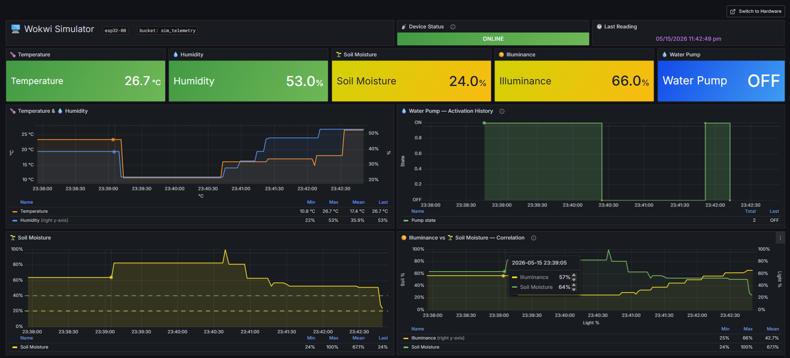
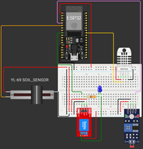
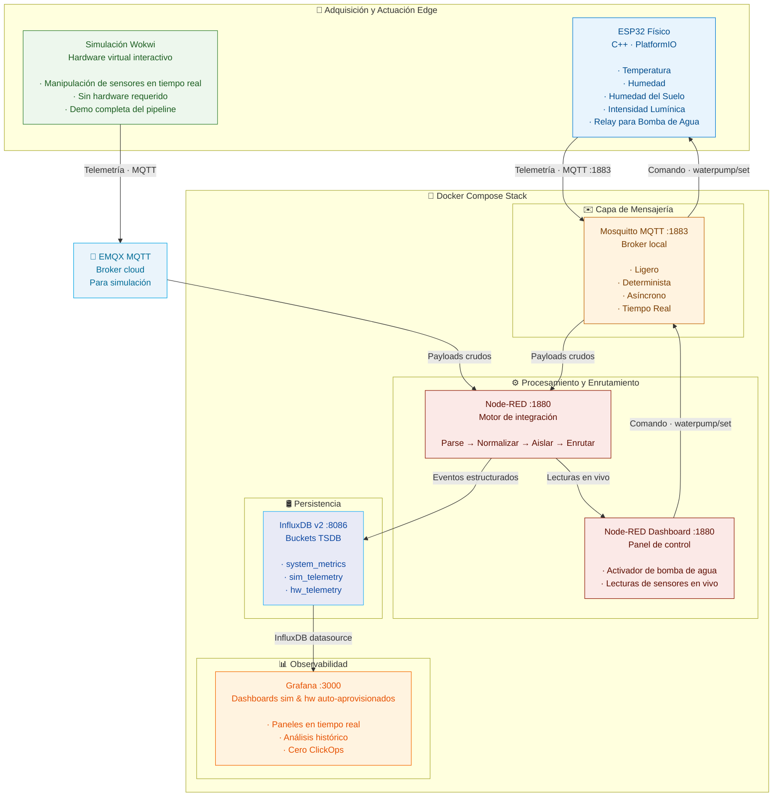
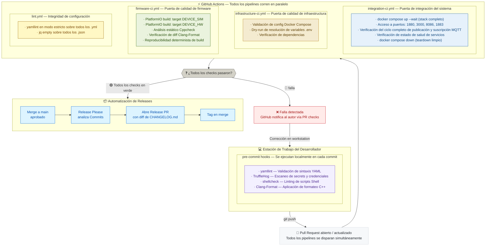

<a id="readme-top"></a>
<div align="center">

# Edge-Telemetry-Pipeline

[![Firmware-CI][firmware-ci-shield]][firmware-ci-url]
[![Infrastructure-CI][infrastructure-ci-shield]][infrastructure-ci-url]
[![Integration-CI][integration-ci-shield]][integration-ci-url]
[![Lint][lint-shield]][lint-url]
[![Release][release-shield]][release-url]
[![License][license-shield]][license-url]
[![EN][lang-en-shield]][lang-en-url]



### Construido con
[![Espressif][espressif-shield]][espressif-url]
[![PlatformIO][platformio-shield]][platformio-url]
[![C++][c++-shield]][c++-url]
[![Docker][docker-shield]][docker-url]
[![MQTT][mqtt-shield]][mqtt-url]
[![NodeRed][nodered-shield]][nodered-url]
[![InfluxDB][influxdb-shield]][influxdb-url]
[![Grafana][grafana-shield]][grafana-url]

### Arquitectura IoT de Grado Industrial con Infraestructura DevOps

*Una plataforma de telemetría distribuida de estilo productivo que demuestra la gestión completa del ciclo de vida IoT — desde la adquisición física de datos con sensores en dispositivos ESP32, hasta infraestructura cloud-native containerizada, observabilidad automatizada y prácticas CI/CD de grado empresarial.*
</div>

---

## Contexto de Ingeniería

Desarrollado por **Omar Alonso Del Rio Peralta** — Licenciado en Ciencias Computacionales con enfoque en **DevOps, infraestructura, sistemas IoT e ingeniería cloud-native**.

Este proyecto funciona como un portafolio que demuestra ingeniería práctica en firmware, infraestructura, observabilidad y CI/CD a nivel producción.

**[Más sobre el autor](#sobre-el-autor)**

---

## Por Qué Existe Este Proyecto

La mayoría de los proyectos IoT se detienen en el sensor. Este no.

**Edge-Telemetry-Pipeline** fue construido para responder una pregunta específica: *¿cómo luce realmente un sistema de telemetría IoT en producción cuando se aplica disciplina de ingeniería en cada capa?*

El resultado es un sistema con un ciclo de vida de telemetría completo: adquisición de datos con sensores en el borde físico, mensajería asíncrona confiable vía MQTT, procesamiento de eventos en tiempo real, persistencia de datos en series temporales, y observabilidad operativa a través de dashboards analíticos — desplegado como infraestructura reproducible definida enteramente como código.

Esto no es una demo. Es una arquitectura de referencia.

El proyecto opera bajo la iniciativa de consultoría **SIPA**, una marca tecnológica enfocada en modernizar infraestructura física y diseñar sistemas confiables a través de tecnología cloud-native e implementación de arquitecturas robustas. Las decisiones de ingeniería tomadas aquí reflejan directamente los estándares de calidad aplicados en ese contexto.

**Principios de ingeniería aplicados en todo el proyecto:**

| Principio | Implementación |
|---|---|
| **Shift-Left Quality** | Pre-commit hooks, análisis estático y linting se ejecutan antes de que el código llegue a CI |
| **Infrastructure as Code (IaC)** | Todos los servicios se definen de forma declarativa; cero configuración manual requerida |
| **Reproducibilidad** | Cualquier despliegue en cualquier host produce un entorno idéntico y determinista |
| **Seguridad por Defecto** | Las credenciales nunca están hardcodeadas; los secrets se inyectan vía `.env` en tiempo de ejecución |
| **Observabilidad Primero** | Los dashboards y fuentes de datos se aprovisionan automáticamente en cada despliegue |

<details open>
  <summary><h3 style="display: inline;">Tabla de Contenidos</h3></summary>

- [Tech Stack](#tech-stack)
- [Características Principales](#características-principales)
- [Inicio Rápido](#inicio-rápido)
- [Arquitectura del Sistema](#arquitectura-del-sistema)
- [Estructura del Repositorio](#estructura-del-repositorio)
- [Estrategia de Testing y Calidad](#estrategia-de-testing-y-calidad)
- [Pipeline CI/CD](#pipeline-cicd)
- [Roadmap](#roadmap)
- [Sobre el Autor](#sobre-el-autor)
</details>

---

## Tech Stack

| Dominio | Tecnología | Rol |
|---|---|---|
| **Firmware Edge** | ESP32 · C++17 · PlatformIO | Adquisición de sensores, publicación MQTT, compilación en entorno dual |
| **Hardware Virtual** | Wokwi | Simulación interactiva de ESP32 con control de sensores en tiempo real |
| **Protocolo de Mensajería** | MQTT · Mosquitto · EMQX | Transporte de telemetría publish-subscribe asíncrono |
| **Motor de Procesamiento** | Node-RED | Integración basada en flujos, parsing de payloads, enrutamiento de eventos y control de actuadores |
| **Base de Datos de Series Temporales** | InfluxDB v2 | Almacenamiento cronológico de métricas con aislamiento de buckets por entorno |
| **Plataforma de Observabilidad** | Grafana | Visualización de dashboards con aprovisionamiento declarativo automático |
| **Orquestación de Contenedores** | Docker · Docker Compose | Despliegue completo del stack, aislamiento de red y gestión del ciclo de vida de servicios |
| **Automatización CI/CD** | GitHub Actions | Pipelines de validación multi-etapa para lint, firmware, infraestructura e integración |
| **Análisis Estático** | Cppcheck | Detección preventiva de defectos en firmware C++ (errores de memoria, comportamiento indefinido) |
| **Formateo de Código** | Clang-Format | Aplicación determinista del estilo C++ en todas las builds |
| **Validación YAML** | yamllint | Validación estricta de sintaxis en todos los archivos de configuración |
| **Escaneo de Secrets** | TruffleHog | Prevención de fuga de credenciales en el pipeline pre-commit |
| **Gestión de Releases** | Release Please · SemVer | Generación automatizada de changelogs y releases versionados vía Conventional Commits |
| **Framework Pre-commit** | pre-commit | Hooks de validación local que garantizan calidad antes de que los commits lleguen a CI |

<p align="right">(<a href="#readme-top">volver arriba</a>)</p>

---

## Características Principales

### Entornos de Ejecución Duales: Simulación vs. Hardware Físico

El firmware soporta dos entornos completamente aislados controlados mediante directivas de preprocesador C++ — produciendo binarios distintos desde una única base de código unificada:

```cpp
#if defined(DEVICE_SIM)
    // Entorno virtual Wokwi: lecturas de sensores desde hardware simulado
    #include "config_sim.h"
#elif defined(DEVICE_HW)
    // ESP32 físico: lecturas de sensores desde periféricos reales
    #include "config_hw.h"
#endif
```

Este diseño mantiene una **única base de código unificada** mientras produce dos binarios de firmware distintos — uno para simulación virtual y otro para despliegue físico — sin overhead de ramificación en tiempo de ejecución.

El entorno de simulación corre sobre **[Wokwi](https://wokwi.com/)**, una plataforma interactiva de hardware virtual. Los valores de los sensores se manipulan por interacción del usuario en tiempo real — la telemetría se propaga por el pipeline completo y los dashboards se actualizan en vivo, sin necesidad de hardware físico. Esto permite demostraciones remotas completamente reproducibles del sistema completo.

### Comunicación MQTT Bidireccional y Control de Actuadores

El sistema implementa comunicación MQTT bidireccional completa. El ESP32 no solo publica telemetría — también se suscribe a topics de actuación y acciona salidas físicas en respuesta a comandos:

- El **dashboard de control de Node-RED** publica comandos a Mosquitto para usar la bomba de agua
- Mosquitto distribuye el comando al ESP32 suscrito
- El ESP32 activa el pin del relay, encendiendo la bomba de agua física

En la simulación de Wokwi, el mismo flujo de comandos activa un indicador LED que representa el estado de la bomba — demostrando el loop de control completo sin hardware físico.

### Observabilidad Automatizada — Cero Configuración Manual

Grafana se aprovisiona enteramente a través de archivos de configuración versionados. Cada despliegue automáticamente:

- Registra **InfluxDB como datasource** vía `influxdb.yml`
- Inyecta **dashboards analíticos pre-construidos** para entornos de simulación (`sipa_sim.json`) y hardware físico (`sipa_hw.json`)
- Produce un **entorno de observabilidad idéntico y determinista** en cada despliegue — sin clicks en el navegador, sin configuración manual

### Infraestructura Containerizada con Aislamiento de Red

Todo el backend se orquesta a través de **Docker Compose** con una red bridge interna dedicada. Los servicios se comunican exclusivamente a través de esta red aislada; solo los puertos mínimos requeridos se exponen al host:

| Servicio | Puerto Host | Propósito |
|---|---|---|
| Grafana | `3000` | Visualización de dashboards |
| Node-RED | `1880` | Editor de flujos, motor de procesamiento y dashboard de control |
| InfluxDB | `8086` | UI y API de la base de datos de series temporales |
| Mosquitto | `1883` | Broker MQTT para hardware físico |

### Aprovisionamiento Determinista de Base de Datos

La creación de buckets en InfluxDB se automatiza mediante `setup-buckets.sh`, ejecutado durante la inicialización del contenedor. Cada despliegue inicia con un esquema de almacenamiento pre-configurado y consistente — sin intervención manual requerida:

| Bucket | Propósito |
|---|---|
| `system_metrics` | Telemetría de salud de infraestructura y servicios |
| `sim_telemetry` | Telemetría del entorno de simulación Wokwi |
| `hw_telemetry` | Telemetría de despliegues de hardware ESP32 físico |

### Gestión de Secrets — Sin Credenciales Hardcodeadas

Todos los valores sensibles — credenciales de base de datos, tokens de administración, parámetros de servicio — se inyectan en tiempo de ejecución a través de un archivo `.env` centralizado, **nunca hardcodeados** en el código. El repositorio incluye una plantilla `.env.example`, permitiendo distribución pública segura sin exposición de credenciales. Cero credenciales existen en el código o en el historial de git.

El mismo principio aplica a la capa de firmware: las credenciales WiFi y la dirección del broker MQTT se definen en `secrets.h`, que está en el gitignore. `secrets.example.h` es la única referencia de credenciales versionada para despliegues en hardware — las credenciales reales nunca se versionan en ninguna capa del stack.

> [!WARNING]
> Las credenciales hardcodeadas en firmware o configuraciones Docker son una falla de seguridad común en proyectos IoT. Este proyecto aplica inyección de secrets vía `.env` en cada capa — firmware, broker, base de datos y dashboard.

### Lo Que Demuestra Este Proyecto

Edge-Telemetry-Pipeline fue construido con un objetivo específico: producir una pieza de portafolio que refleje cómo se diseñan realmente los sistemas en producción — no cómo se enseñan en entornos académicos.

Este proyecto demuestra una capacidad de ingeniería integrada: hardware comunicándose con firmware, firmware publicando a un broker, un broker alimentando un motor de procesamiento, un motor de procesamiento escribiendo a una base de datos de series temporales, una base de datos impulsando dashboards auto-aprovisionados — todo validado por un pipeline CI/CD multi-etapa, todo desplegado con un único comando.

| Dominio | Capacidades Demostradas |
|---|---|
| **Arquitectura IoT** | Ciclo de vida de telemetría end-to-end, control MQTT bidireccional, diseño de firmware multi-entorno |
| **Ingeniería DevOps** | Pipelines GitHub Actions, validación Shift-Left, IaC, automatización de releases semánticos |
| **Infraestructura Cloud** | Orquestación de servicios containerizados, aislamiento de red, aprovisionamiento declarativo, gestión de secrets |
| **Observabilidad** | Auto-aprovisionamiento de dashboards Grafana, modelado de datos de series temporales InfluxDB, aislamiento por buckets |
| **Sistemas Embebidos** | Firmware ESP32 en C++17, builds dual-target con PlatformIO, actuación de relay, simulación de hardware |
| **Calidad de Software** | Estrategia de validación multi-capa, análisis estático, builds deterministas, política de zero-warnings |

<p align="right">(<a href="#readme-top">volver arriba</a>)</p>

---

## Inicio Rápido

### Prerequisitos

- [Docker](https://docs.docker.com/get-docker/) y [Docker Compose](https://docs.docker.com/compose/install/) v2+
- [PlatformIO Core](https://platformio.org/install/cli) *(solo para compilación de firmware)*
- [pre-commit](https://pre-commit.com/) *(desarrollo local)*

### Desplegar el Stack de Infraestructura Completo

**1. Clona el repositorio:**

```bash
git clone https://github.com/AlonsoDelRio/Edge-Telemetry-Pipeline.git
cd Edge-Telemetry-Pipeline/docker
```

**2. Configura los secrets:**

```bash
cp .env.example .env
# Completa credenciales, tokens y contraseñas de servicios en .env
```

> [!IMPORTANT]
> `.env` está excluido del control de versiones por diseño. `.env.example` es la única referencia de credenciales versionada — completa tu `.env` local a partir de ella y nunca la commitees.

**3. Levanta el stack completo:**

```bash
docker compose up -d
```

**4. Accede a los servicios:**

| Servicio | URL | Notas |
|---|---|---|
| **Grafana** | http://localhost:3000 | Dashboards auto-aprovisionados — sin configuración requerida |
| **Node-RED** | http://localhost:1880 | Editor de flujos y dashboard de control |
| **InfluxDB** | http://localhost:8086 | Base de datos de series temporales e interfaz de consultas |

> [!TIP]
> Los dashboards de Grafana para los entornos de simulación y hardware físico están disponibles inmediatamente después de que el stack inicia — sin configuración en el navegador requerida.

### Ejecutar la Simulación

Abre la simulación Wokwi configurada en `firmware/diagram.json` y observa la telemetría propagándose por el pipeline completo en tiempo real en los dashboards de Grafana. Ajusta los sliders de sensores — temperatura, humedad, humedad del suelo, intensidad lumínica — para generar eventos de telemetría en vivo.

<div align="center"></div>

> [!NOTE]
> Ejecutar la simulación requiere la extensión [Wokwi for VS Code](https://marketplace.visualstudio.com/items?itemName=wokwi.wokwi-vscode). Abre `firmware/diagram.json` en VS Code y Wokwi lanzará el simulador usando el output de build de PlatformIO. Se requiere una cuenta gratuita en [wokwi.com](https://wokwi.com) para autenticar la extensión — la version gratuita es suficiente para ejecutar simulaciones. La de pago añade edición de componentes drag-and-drop dentro de VS Code, pero no es necesario para este proyecto.

### Despliegue en Hardware Físico *(opcional)*

Si tienes intención de flashear el firmware a un ESP32 físico, configura las credenciales de hardware antes de compilar:

**1. Crea tu archivo de secrets:**

```bash
cp firmware/src/config/secrets.example.h firmware/src/config/secrets.h
```

**2. Edita `secrets.h` con tus credenciales de red:**

```cpp
// Credenciales WiFi
#define WIFI_SSID     "TU_NOMBRE_DE_RED"
#define WIFI_PASSWORD "TU_CONTRASEÑA_DE_RED"

// IP de la máquina donde corre Docker Compose
#define MQTT_HOST IPAddress(192, 168, 1, 100)
#define MQTT_PORT 1883
```

> [!IMPORTANT]
> `secrets.h` está excluido del control de versiones por diseño. `secrets.example.h` es la única referencia de credenciales versionada — nunca se versionan credenciales de hardware en ninguna capa del stack.

**3. Compila y flashea usando PlatformIO:**

```bash
cd firmware
pio run --environment esp32 --target upload
```

> [!NOTE]
> En Windows, ejecuta este comando desde la terminal integrada de PlatformIO (**Quick Access → Miscellaneous → New Terminal**) para garantizar que el CLI `pio` esté disponible en el PATH.

### Configurar Hooks de Desarrollo Local

```bash
pip install pre-commit
pre-commit install
```

Todos los commits subsecuentes validarán automáticamente la sintaxis YAML, escanearán fugas de credenciales, aplicarán estándares de shell scripts y verificarán el formateo C++ antes de llegar a CI.

<p align="right">(<a href="#readme-top">volver arriba</a>)</p>

---

## Arquitectura del Sistema

La plataforma implementa un pipeline modular por capas donde cada componente tiene una responsabilidad única y bien definida.



### Flujo de Telemetría en Resumen

| # | Capa | Tecnología | Responsabilidad |
|---|---|---|---|
| 1 | **Adquisición y Actuación** | ESP32 · C++ · PlatformIO · Wokwi | Recolectar variables de sensores en el borde; recibir comandos de control para la bomba de agua vía MQTT |
| 2 | **Mensajería** | Mosquitto · EMQX | Mosquitto gestiona tráfico de hardware físico localmente; EMQX gestiona tráfico de simulación vía cloud |
| 3 | **Procesamiento y Control** | Node-RED | Parsing de payloads, normalización, aislamiento de entornos, enrutamiento; publica comandos de actuación vía dashboard |
| 4 | **Persistencia** | InfluxDB v2 | Almacenamiento optimizado de series temporales en buckets aislados auto-aprovisionados |
| 5 | **Observabilidad** | Grafana | Dashboards analíticos aprovisionados dinámicamente en cada despliegue |

### Namespace de Topics MQTT

El sistema aplica una estructura jerárquica de topics que permite enrutamiento escalable, aislamiento multi-entorno y filtrado a nivel de flota de dispositivos.

> [!NOTE]
> Los topics de simulación llevan el prefijo `sipa/` para garantizar aislamiento de namespace en el broker público compartido de EMQX. Los topics de hardware físico omiten este prefijo ya que operan en una instancia privada local de Mosquitto.

**Topics de telemetría — entrada (simulación):**
```
sipa/edge-pipeline/sim/esp32-00/dht/temperature
sipa/edge-pipeline/sim/esp32-00/dht/humidity
sipa/edge-pipeline/sim/esp32-00/soil/moisture
sipa/edge-pipeline/sim/esp32-00/ldr/light
```

**Topics de telemetría — entrada (hardware físico):**
```
edge-pipeline/hw/esp32-00/dht/temperature
edge-pipeline/hw/esp32-00/dht/humidity
edge-pipeline/hw/esp32-00/soil/moisture
edge-pipeline/hw/esp32-00/ldr/light
```

**Topics de actuación — salida:**
```
sipa/edge-pipeline/sim/esp32-00/waterpump/set
edge-pipeline/hw/esp32-00/waterpump/set
```

<p align="right">(<a href="#readme-top">volver arriba</a>)</p>

---

<details>
  <summary><h2 style="display: inline;">Estructura del Repositorio</h2></summary>

```
Edge-Telemetry-Pipeline/
│
│   .clang-format                  # Reglas de formateo C++ (Clang-Format)
│   .gitattributes                 # Normalización de saltos de línea entre plataformas
│   .pre-commit-config.yaml        # Hooks de validación pre-commit local
│   .yamllint.yml                  # Configuración de linting YAML
│   .release-please-manifest.json  # Manifiesto de seguimiento de versiones de Release Please
│   CHANGELOG.md                   # Auto-generado vía Release Please (SemVer)
│   release-please-config.json     # Configuración de paquete de Release Please
│
├── .github/
│   └── workflows/
│       ├── firmware-ci.yml        # Pipeline de build + análisis estático de firmware
│       ├── infrastructure-ci.yml  # Pipeline de validación de Docker Compose
│       ├── integration-ci.yml     # Pipeline de smoke tests del stack completo
│       ├── lint.yml               # Pipeline de linting YAML y JSON
│       └── release-please.yml     # Pipeline de automatización de releases y changelog
│
├── docker/                        # Stack de infraestructura containerizada
│   │   .env.example               # Plantilla de secrets (segura para commitear)
│   │   .env                       # Secrets en tiempo de ejecución (en gitignore)
│   │   docker-compose.yml         # Definición de orquestación del stack completo
│   │
│   ├── grafana/
│   │   ├── dashboards/
│   │   │   ├── sipa_hw.json       # Dashboard de observabilidad de hardware físico
│   │   │   └── sipa_sim.json      # Dashboard de observabilidad de simulación
│   │   └── provisioning/
│   │       ├── dashboards/
│   │       │   └── dashboards.yml # Configuración de auto-aprovisionamiento de dashboards
│   │       └── datasources/
│   │           └── influxdb.yml   # Auto-aprovisionamiento de datasource InfluxDB
│   │
│   ├── influxdb/
│   │   ├── setup-buckets.sh       # Script de inicialización determinista de buckets
│   │   ├── config/
│   │   │   └── .gitkeep           # Preserva el directorio para el montaje de config de InfluxDB
│   │   └── data/
│   │       └── .gitkeep           # Preserva el directorio para el montaje de datos de InfluxDB
│   │
│   ├── mosquitto/
│   │   └── config/
│   │       └── mosquitto.conf     # Configuración de listener y acceso del broker
│   │
│   └── nodered/
│       │   dockerfile             # Definición de imagen personalizada de Node-RED
│       └── data/
│           ├── flows.json         # Flujos de procesamiento y enrutamiento de telemetría
│           └── package.json       # Dependencias de nodos Node-RED
│
├── docs/
│   └── images/
│        ├── dashboard-view.png    # Captura del dashboard de observabilidad Grafana
│        └── wokwi-sim.png         # Captura de la simulación interactiva Wokwi
│
└── firmware/                      # Código fuente del dispositivo edge ESP32
    │   diagram.json               # Esquema del circuito virtual Wokwi
    │   platformio.ini             # Entornos de build: targets sim y hw
    │   wokwi.toml                 # Configuración de entrada de simulación Wokwi
    │
    ├── .vscode/
    │   └── extensions.json        # Extensiones recomendadas y no recomendadas de VS Code
    │
    └── src/
        │   main.cpp               # Punto de entrada unificado del firmware
        │
        └── config/
            ├── config.h           # Header de configuración compartida
            ├── config_hw.h        # Parámetros específicos de hardware
            ├── config_sim.h       # Parámetros específicos de simulación
            ├── secrets.example.h  # Plantilla de credenciales para despliegue en hardware
            └── secrets.h          # Credenciales locales — en gitignore, nunca se commitea
```

<p align="right">(<a href="#readme-top">volver arriba</a>)</p>

</details>

---

## Estrategia de Testing y Calidad

Testear un sistema de telemetría IoT distribuido requiere una estrategia diseñada en torno a sus modos de falla reales: infraestructura mal configurada, comunicación entre servicios rota y payloads de datos malformados. Este proyecto aplica un **modelo de validación multi-capa** apropiado para esa realidad.

| Capa | Alcance | Herramientas | Confianza |
|---|---|---|---|
| 🔴 **L4 — Integración** | Sistema completo end-to-end | Docker Compose · MQTT round-trip | Máxima |
| 🟠 **L3 — Infraestructura** | Stack de contenedores | Compose dry-run · Verificación de puertos | Alta |
| 🟡 **L2 — Build** | Compilación de firmware | PlatformIO · Inyección de versión | Media-Alta |
| 🟢 **L1 — Análisis Estático** | Código fuente | Cppcheck · Clang-Format · yamllint · TruffleHog | Fundacional |

### Capa 1 — Análisis Estático y Linting

Aplicado antes de que cualquier código llegue a CI, capturando defectos al menor costo posible:

- **Cppcheck** — Detecta comportamiento indefinido, errores de memoria y defectos lógicos en el firmware C++ sin ejecutar el binario
- **Clang-Format** — Aplica formateo determinista de C++ en todas las builds; el pipeline falla ante cualquier diff de formateo sin stagear
- **yamllint** — Valida todos los archivos de configuración YAML contra reglas de sintaxis estrictas
- **jq empty** — Verifica la integridad estructural de todos los archivos JSON (dashboards Grafana, flujos Node-RED, diagramas Wokwi)
- **TruffleHog** — Escanea el historial de commits en busca de fugas de credenciales en el hook pre-commit, antes de que lleguen al repositorio remoto

### Capa 2 — Validación de Build de Firmware

Cada cambio en el firmware dispara una compilación determinista de PlatformIO en un entorno CI aislado:

- Compila los targets `DEVICE_SIM` y `DEVICE_HW` de forma independiente
- Inyecta identificadores de versión exactos en cada binario para trazabilidad completa
- Trata los warnings del compilador como errores — política de zero-warnings aplicada en cada build

### Capa 3 — Validación de Infraestructura

El stack de Docker Compose se valida en CI mediante un dry-run estructurado que verifica:

- Sintaxis y correctitud del esquema del archivo Compose
- Resolución de variables de entorno desde `.env`
- Consistencia del grafo de dependencias entre servicios

### Capa 4 — Pruebas de Integración (Smoke Tests)

La capa de validación con mayor nivel de confianza: toda la infraestructura se levanta dentro de un runner activo de GitHub Actions y es sometida a validaciones end-to-end bajo un enfoque de caja negra:

- **Verificación de puertos** confirma que todos los servicios son accesibles desde las direcciones de red esperadas
- **Prueba de round-trip MQTT** publica un mensaje al broker y verifica su recepción en el suscriptor — confirmando que la capa de mensajería completa es operativa bajo condiciones reales
- **Validación de salud de servicios** asegura que todos los contenedores alcancen un estado operativo saludable antes de aprobar cualquier cambio para merge

> [!IMPORTANT]
> En arquitecturas de telemetría distribuida, un round-trip MQTT exitoso en un entorno containerizado live ofrece mayor confianza que assertions unitarias aisladas.
> Las pruebas de integración son la principal barrera de calidad porque validan los modos de falla que realmente ocurren en producción — no los que son convenientes de mockear.

<p align="right">(<a href="#readme-top">volver arriba</a>)</p>

---

## Pipeline CI/CD

El ciclo de vida del desarrollo aplica una metodología **Shift-Left** — la calidad, seguridad e integración se validan en la etapa más temprana posible, antes de que los defectos se acumulen aguas abajo.



### Desglose de Pipelines

| Pipeline | Activador | Validaciones Clave |
|---|---|---|
| **Lint** | Pull Request | Sintaxis YAML, integridad estructural de archivos JSON |
| **Firmware CI** | Pull Request | Build determinista dual-target, análisis estático, formateo C++ |
| **Infrastructure CI** | Pull Request | Validación de Compose, resolución de variables `.env` |
| **Integration CI** | Pull Request | Levantamiento completo del stack, verificación de puertos, smoke test de round-trip MQTT |

<p align="right">(<a href="#readme-top">volver arriba</a>)</p>

---

## Roadmap

El release actual representa un pipeline de telemetría completamente operativo. Las siguientes capacidades están planificadas para iteraciones futuras:

#### ✅ Completado — v2.0.0
- [x] Pipeline de telemetría completo: ESP32 → MQTT → Node-RED → InfluxDB → Grafana
- [x] Comunicación MQTT bidireccional con actuación de bomba de agua
- [x] Entorno de ejecución dual: hardware físico y simulación Wokwi
- [x] Observabilidad automatizada con aprovisionamiento Grafana y sin ClickOps
- [x] Pipeline CI/CD multi-etapa con GitHub Actions
- [x] Versionamiento semántico y changelog automatizado vía Release Please

#### 🔧 En Progreso / Planificado
- [ ] **Panel de Administración** — Interfaz de control dedicada para configurar condiciones de activación de la bomba, intervalos de medición, recalibración de sensores y diagnósticos del dispositivo
- [ ] **Integración de Telegraf** — Agente de recolección de métricas para extender el pipeline de observabilidad con fuentes de datos adicionales y flexibilidad de enrutamiento
- [ ] **Hardening de Seguridad** — Modelo de seguridad progresivo que cubre TLS en MQTT, autenticación a nivel de servicio e introducción potencial de una capa de identidad dedicada

> [!NOTE]
> Este proyecto está en desarrollo activo bajo la iniciativa de consultoría SIPA. El roadmap refleja prioridades de ingeniería reales, no ítems de relleno.

<p align="right">(<a href="#readme-top">volver arriba</a>)</p>

---

<div align="center">

## Sobre el Autor

**Omar Alonso Del Rio Peralta**<br>
*Licenciado en Ciencias Computacionales · Ingeniero de Infraestructura, DevOps e IoT*

[![LinkedIn][linkedin-shield]][linkedin-url]
[![GitHub][github-shield]][github-url]
[![Email][email-shield]][email-url]

</div>

### Perfil de Ingeniería

Licenciado en Ciencias Computacionales por la **Universidad Autónoma de Baja California** (Facultad de Ciencias, 2024), con una trayectoria técnica construida progresivamente desde 2016 en operaciones de TI, administración de sistemas e investigación aplicada — culminando en el diseño de esta arquitectura IoT de referencia.

Mi background es multidisciplinario por naturaleza, no por casualidad. Antes y durante mi carrera, trabajé en tres entornos técnicos distintos:

- **Sector público (Poder Judicial de Baja California):** Completé los requerimientos formales de prácticas técnicas como parte de un programa para ser técnico en programación certificado. Administré servidores de producción, configuré redes IP en entornos de oficina y realicé mantenimiento preventivo y correctivo de hardware y sistemas operativos — mi primera exposición directa a operaciones de infraestructura en un entorno institucional real.

- **Investigación (Centro de Nanociencias y Nanotecnología — UNAM):** Trabajando junto al Dr. Fernando Rojas Iñiguez, repliqué el paper IEEE <a href="https://ieeexplore.ieee.org/document/4215941" target="_blank">*Quantum Robots for Teenagers*</a> como ejercicio pedagógico para hacer la computación cuántica accesible a audiencias jóvenes. También operé una computadora cuántica **SpinQ Gemini Mini**, obteniendo exposición práctica a hardware cuántico real en una etapa temprana de mi carrera.

- **Sector educativo (IUNIVERSI):** Como referente técnico único, migré el hosting web institucional con requerimientos de uptime, diseñé un servidor NAS sobre Raspberry Pi para gestión centralizada de datos, y resolví incidencias de red y hardware — concluyendo con una carta de recomendación formal del director.

Mi trayectoria académica incluyó un programa de intercambio internacional en España, reforzando adaptabilidad y exposición a entornos académicos y de ingeniería europeos.

### Credenciales

| Credencial | Emisor | Detalles |
|---|---|---|
| **TensorFlow Developer Certificate** | DeepLearning.AI · Coursera | Completado julio 2024 · [Verificar](https://www.coursera.org/account/accomplishments/specialization/9YBXEEGUVBT7) |
| **Licenciatura en Ciencias Computacionales** | Universidad Autónoma de Baja California · 2024 | Cédula Profesional emitida por SEP México |

### Abierto a Oportunidades

Estoy listo para llevar este rigor arquitectónico a un puesto de ingeniería de tiempo completo en:

- Ingeniería de Infraestructura y Sistemas
- DevOps y Platform Engineering
- Cloud y Automatización
- Ingeniería de Plataformas IoT

Cuento con **fluidez bilingüe profesional en español e inglés**, experiencia técnica multi-sector y la capacidad de operar a través del stack tecnológico completo — desde hardware físico hasta infraestructura cloud-native.

> *«Si crees que la buena arquitectura es cara, prueba la mala arquitectura.»*
> — Brian Foote & Joseph Yoder, *Big Ball of Mud* (1999)

<p align="right">(<a href="#readme-top">volver arriba</a>)</p>

---

<div align="center">

**[LinkedIn](https://linkedin.com/in/alonso-delrio-)** · **[Portafolio GitHub](https://github.com/AlonsoDelRio)** · **omaroadrp@gmail.com**

</div>

[firmware-ci-shield]: https://img.shields.io/github/actions/workflow/status/AlonsoDelRio/Edge-Telemetry-Pipeline/firmware-ci.yml?style=flat-square&label=Firmware%20CI&logo=github&logoColor=white
[firmware-ci-url]: https://github.com/AlonsoDelRio/Edge-Telemetry-Pipeline/actions/workflows/firmware-ci.yml
[infrastructure-ci-shield]: https://img.shields.io/github/actions/workflow/status/AlonsoDelRio/Edge-Telemetry-Pipeline/infrastructure-ci.yml?style=flat-square&label=Infrastructure%20CI&logo=github&logoColor=white
[infrastructure-ci-url]: https://github.com/AlonsoDelRio/Edge-Telemetry-Pipeline/actions/workflows/infrastructure-ci.yml
[integration-ci-shield]: https://img.shields.io/github/actions/workflow/status/AlonsoDelRio/Edge-Telemetry-Pipeline/integration-ci.yml?style=flat-square&label=Integration%20CI&logo=github&logoColor=white
[integration-ci-url]: https://github.com/AlonsoDelRio/Edge-Telemetry-Pipeline/actions/workflows/integration-ci.yml
[lint-shield]: https://img.shields.io/github/actions/workflow/status/AlonsoDelRio/Edge-Telemetry-Pipeline/lint.yml?style=flat-square&label=Lint&logo=github&logoColor=white
[lint-url]: https://github.com/AlonsoDelRio/Edge-Telemetry-Pipeline/actions/workflows/lint.yml
[release-shield]: https://img.shields.io/github/v/release/AlonsoDelRio/Edge-Telemetry-Pipeline?style=flat-square&logo=semanticrelease&logoColor=white&color=0075ff
[release-url]: https://github.com/AlonsoDelRio/Edge-Telemetry-Pipeline/releases/latest
[license-shield]: https://img.shields.io/badge/license-MIT-yellowgreen?style=flat-square&logo=opensourceinitiative&logoColor=white
[license-url]: LICENSE
[lang-en-shield]: https://img.shields.io/badge/Read_this_in-English-0969da?style=flat-square&logo=googletranslate&logoColor=white
[lang-en-url]: README.md

[espressif-shield]: https://img.shields.io/badge/ESP--32-E7352C?style=for-the-badge&logo=espressif&logoColor=white
[espressif-url]: https://www.espressif.com/
[docker-shield]: https://img.shields.io/badge/Docker-2496ED?style=for-the-badge&logo=docker&logoColor=white
[docker-url]: https://www.docker.com/
[platformio-shield]: https://img.shields.io/badge/PlatformIO-F5822A?style=for-the-badge&logo=platformio&logoColor=white
[platformio-url]: https://platformio.org/
[c++-shield]: https://img.shields.io/badge/C++-00599C?style=for-the-badge&logo=cplusplus&logoColor=white
[c++-url]: https://isocpp.org/
[mqtt-shield]: https://img.shields.io/badge/MQTT-660066?style=for-the-badge&logo=mqtt&logoColor=white
[mqtt-url]: https://mqtt.org/
[nodered-shield]: https://img.shields.io/badge/Node--Red-8F0000?style=for-the-badge&logo=nodered&logoColor=white
[nodered-url]: https://nodered.org/
[influxdb-shield]: https://img.shields.io/badge/InfluxDB-22ADF6?style=for-the-badge&logo=influxdb&logoColor=white
[influxdb-url]: https://www.influxdata.com/
[grafana-shield]: https://img.shields.io/badge/Grafana-F46800?style=for-the-badge&logo=grafana&logoColor=white
[grafana-url]: https://grafana.com/

[linkedin-shield]: https://img.shields.io/badge/LinkedIn-0A66C2?style=flat-square&logo=linkedin&logoColor=white
[linkedin-url]: https://linkedin.com/in/alonso-delrio-
[github-shield]: https://img.shields.io/badge/GitHub-181717?style=flat-square&logo=github&logoColor=white
[github-url]: https://github.com/AlonsoDelRio
[email-shield]: https://img.shields.io/badge/Email-EA4335?style=flat-square&logo=gmail&logoColor=white
[email-url]: mailto:omaroadrp@gmail.com
