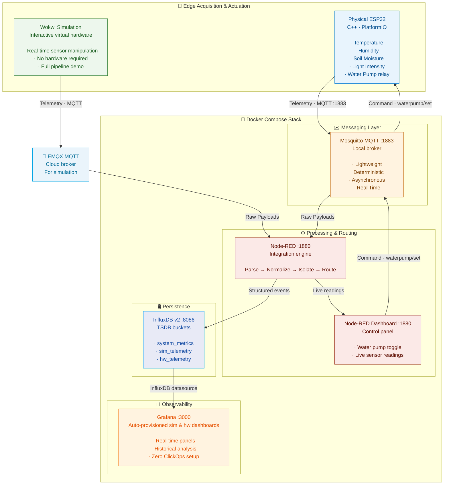
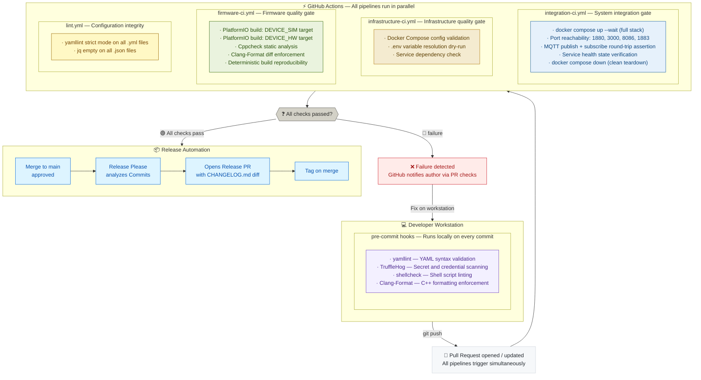

<a id="readme-top"></a>
<div align="center">

# Edge-Telemetry-Pipeline

[![Firmware-CI][firmware-ci-shield]][firmware-ci-url]
[![Infrastructure-CI][infrastructure-ci-shield]][infrastructure-ci-url]
[![Integration-CI][integration-ci-shield]][integration-ci-url]
[![Lint][lint-shield]][lint-url]
[![Release][release-shield]][release-url]
[![License][license-shield]][license-url]
[![ES][lang-es-shield]][lang-es-url]


### Built with
[![Espressif][espressif-shield]][espressif-url]
[![PlatformIO][platformio-shield]][platformio-url]
[![C++][c++-shield]][c++-url]
[![Docker][docker-shield]][docker-url]
[![MQTT][mqtt-shield]][mqtt-url]
[![NodeRed][nodered-shield]][nodered-url]
[![InfluxDB][influxdb-shield]][influxdb-url]
[![Grafana][grafana-shield]][grafana-url]

### Industrial-Grade IoT Telemetry Architecture with DevOps-Driven Infrastructure

*A production-style distributed telemetry platform demonstrating end-to-end IoT lifecycle management — from physical sensor acquisition on ESP32 edge devices to containerized cloud-native infrastructure, automated observability, and professional-grade CI/CD practices.*
</div>

---

## Engineering Context

Built by **Omar Alonso Del Rio Peralta** — Computer Science graduate focused on **DevOps, infrastructure, IoT systems, and cloud-native engineering**.

This project serves as a production-style portfolio demonstrating practical engineering across firmware, infrastructure, observability, and CI/CD.

**[More about the author](#about-the-author)**

---

## Why This Project Exists

Most IoT projects stop at the sensor. This one doesn't.

**Edge-Telemetry-Pipeline** was built to answer a specific question: *what does a production IoT telemetry system actually look like when engineering discipline is applied at every layer?*

The result is a system with a complete telemetry lifecycle: sensor acquisition at the physical edge, reliable asynchronous messaging via MQTT, real-time event processing, time-series persistence, and operational observability through analytical dashboards — deployed as reproducible infrastructure defined entirely as code.

This is not a demo. It is a reference architecture.

The project operates under the **SIPA** consulting initiative, a technology brand focused on modernizing physical infrastructure and designing reliable systems through cloud-native technology and robust architecture implementation. The engineering decisions made here directly reflect the quality standards applied in that consulting context.

**Core engineering principles applied throughout the project:**

| Principle | Implementation |
|---|---|
| **Shift-Left Quality** | Pre-commit hooks, static analysis, and linting execute before code reaches CI |
| **Infrastructure as Code (IaC)** | All services are defined declaratively; zero manual configuration required |
| **Reproducibility** | Any deployment on any host produces an identical, deterministic environment |
| **Security by Default** | Credentials are never hardcoded; secrets are injected via `.env` at runtime |
| **Observability-First** | Dashboards and data sources are provisioned automatically on every deployment |

<details open>
  <summary><h3 style="display: inline;">Table of Contents</h3></summary>

- [Tech Stack](#tech-stack)
- [Key Features](#key-features)
- [Quick Start](#quick-start)
- [System Architecture](#system-architecture)
- [Repository Structure](#repository-structure)
- [Testing & Quality Strategy](#testing--quality-strategy)
- [CI/CD Pipeline](#cicd-pipeline)
- [Roadmap](#roadmap)
- [About the Author](#about-the-author)
</details>

---

## Tech Stack

| Domain | Technology | Role |
|---|---|---|
| **Edge Firmware** | ESP32 · C++17 · PlatformIO | Sensor acquisition, MQTT publishing, dual-environment compilation |
| **Virtual Hardware** | Wokwi | Interactive browser-based ESP32 simulation with real-time sensor control |
| **Messaging Protocol** | MQTT · Mosquitto · EMQX | Asynchronous publish-subscribe telemetry transport |
| **Processing Engine** | Node-RED | Flow-based integration, payload parsing, event routing, and actuation control |
| **Time-Series Database** | InfluxDB v2 | Chronological metric storage with bucket-level environment isolation |
| **Observability Platform** | Grafana | Dashboard visualization with declarative auto-provisioning |
| **Container Orchestration** | Docker · Docker Compose | Full-stack deployment, network isolation, service lifecycle management |
| **CI/CD Automation** | GitHub Actions | Multi-stage validation pipelines for lint, firmware, infra, and integration |
| **Static Analysis** | Cppcheck | Preventive firmware defect detection (memory errors, undefined behavior) |
| **Code Formatting** | Clang-Format | Deterministic C++ style enforcement across all builds |
| **YAML Validation** | yamllint | Strict syntax validation for all configuration files |
| **Secret Scanning** | TruffleHog | Credential leak prevention in the pre-commit pipeline |
| **Release Management** | Release Please · SemVer | Automated changelog generation and versioned releases via Conventional Commits |
| **Pre-commit Framework** | pre-commit | Local validation hooks enforcing quality before commits reach CI |

<p align="right">(<a href="#readme-top">back to top</a>)</p>

---

## Key Features

### Dual Execution Environments: Simulation vs. Physical Hardware

The firmware supports two fully isolated environments controlled through C++ preprocessor directives — producing distinct binaries from a single unified codebase:

```cpp
#if defined(DEVICE_SIM)
    // Wokwi virtual environment: sensor reads from simulated hardware
    #include "config_sim.h"
#elif defined(DEVICE_HW)
    // Physical ESP32: sensor reads from real peripherals
    #include "config_hw.h"
#endif
```

This design maintains a **single unified codebase** while producing two distinct firmware binaries — one for virtual simulation and one for physical deployment — without any runtime branching overhead.

The simulation environment runs on **[Wokwi](https://wokwi.com/)**, an interactive virtual hardware platform. Sensor values are manipulated by user interaction in real time — telemetry propagates through the full pipeline and dashboards update live, with zero physical hardware required. This enables fully reproducible remote demonstrations of the complete system.

### Bidirectional MQTT Communication & Actuation Control

The system implements full bidirectional MQTT communication. The ESP32 does not only publish telemetry — it also subscribes to actuation topics and drives physical outputs in response to commands:

- The **Node-RED control dashboard** publishes pump commands to Mosquitto
- Mosquitto distributes the command to the subscribed ESP32
- The ESP32 activates the relay pin, triggering the physical water pump

In the Wokwi simulation, the same command flow activates an LED indicator that represents the pump state — demonstrating the complete control loop without physical hardware.

### Automated Observability — Zero Manual Configuration

Grafana is provisioned entirely through version-controlled configuration files. Every deployment automatically:

- Registers **InfluxDB as a datasource** via `influxdb.yml`
- Injects **pre-built analytical dashboards** for both simulated (`sipa_sim.json`) and physical hardware (`sipa_hw.json`) environments
- Produces an **identical, deterministic observability environment** across every deployment — no browser clicks, no manual setup

### Containerized Infrastructure with Network Isolation

The entire backend is orchestrated through **Docker Compose** with a dedicated internal bridge network. Services communicate exclusively through this isolated network; only the minimum required ports are exposed to the host:

| Service | Host Port | Purpose |
|---|---|---|
| Grafana | `3000` | Dashboard visualization |
| Node-RED | `1880` | Flow editor, processing engine, and control dashboard |
| InfluxDB | `8086` | Time-series database UI and API |
| Mosquitto | `1883` | MQTT broker for physical hardware |

### Deterministic Database Provisioning

InfluxDB bucket creation is automated through `setup-buckets.sh`, executed at container initialization. Every deployment starts with a pre-configured, consistent storage schema — no manual intervention required:

| Bucket | Purpose |
|---|---|
| `system_metrics` | Infrastructure and service health telemetry |
| `sim_telemetry` | Telemetry from the Wokwi simulation environment |
| `hw_telemetry` | Telemetry from physical ESP32 hardware deployments |

### Secret Management — No Hardcoded Credentials

All sensitive values — database credentials, admin tokens, service parameters — are injected at runtime through a centralized `.env` file, **never hardcoded** in the codebase. The repository includes a `.env.example` template, enabling safe public distribution without credential exposure. Zero credentials exist in the codebase or git history.

The same principle extends to the firmware layer: WiFi credentials and the MQTT broker address are defined in `secrets.h`, which is gitignored. The repository includes `secrets.example.h` as a safe template — actual credentials are never version-controlled at any layer of the stack.

> [!WARNING]
> Credentials hardcoded in firmware or Docker configurations are a common security failure in IoT projects. This project enforces secret injection via `.env` at every layer — firmware, broker, database, and dashboard.

### What This Project Demonstrates

Edge-Telemetry-Pipeline was built with a specific goal: to produce a portfolio piece that reflects how production systems are actually designed — not how they are taught in academic settings.

This project demonstrates an integrated engineering capability: hardware communicating with firmware, firmware publishing to a broker, a broker feeding a processing engine, a processing engine writing to a time-series database, a database powering auto-provisioned dashboards — all validated by a multi-stage CI/CD pipeline, all deployed with a single command.

| Domain | Demonstrated Capabilities |
|---|---|
| **IoT Architecture** | End-to-end telemetry lifecycle, bidirectional MQTT control, multi-environment firmware design |
| **DevOps Engineering** | GitHub Actions pipelines, Shift-Left validation, IaC, semantic release automation |
| **Cloud Infrastructure** | Containerized service orchestration, network isolation, declarative provisioning, secret management |
| **Observability** | Grafana dashboard auto-provisioning, InfluxDB time-series data modeling, bucket isolation |
| **Embedded Systems** | ESP32 firmware in C++17, PlatformIO dual-target builds, relay actuation, hardware simulation |
| **Software Quality** | Multi-layer validation strategy, static analysis, deterministic builds, zero-warning policy |

<p align="right">(<a href="#readme-top">back to top</a>)</p>

---

## Quick Start

### Prerequisites

- [Docker](https://docs.docker.com/get-docker/) and [Docker Compose](https://docs.docker.com/compose/install/) v2+
- [PlatformIO Core](https://platformio.org/install/cli) *(firmware compilation only)*
- [pre-commit](https://pre-commit.com/) *(local development)*

### Deploy the Full Infrastructure Stack

**1. Clone the repository:**

```bash
git clone https://github.com/AlonsoDelRio/Edge-Telemetry-Pipeline.git
cd Edge-Telemetry-Pipeline/docker
```

**2. Configure secrets:**

```bash
cp .env.example .env
# Populate credentials, tokens, and service passwords in .env
```

> [!IMPORTANT]
> `.env` is excluded from version control by design. `.env.example` is the only version-controlled credential reference — populate your local `.env` from it and never commit it.

**3. Launch the complete stack:**

```bash
docker compose up -d
```

**4. Access services:**

| Service | URL | Notes |
|---|---|---|
| **Grafana** | http://localhost:3000 | Dashboards are auto-provisioned — no setup required |
| **Node-RED** | http://localhost:1880 | Flow editor and control dashboard |
| **InfluxDB** | http://localhost:8086 | Time-series database and query interface |

> [!TIP]
> Grafana dashboards for both simulation and physical hardware environments are available immediately after the stack starts — no browser configuration required.

### Run the Simulation

Open the Wokwi simulation configured in `firmware/diagram.json` and observe telemetry propagating through the complete pipeline in real time on the Grafana dashboards. Adjust sensor sliders — temperature, humidity, soil moisture, light intensity — to generate live telemetry events.

<div align="center"></div>

> [!NOTE]
> Running the simulation requires the [Wokwi for VS Code](https://marketplace.visualstudio.com/items?itemName=wokwi.wokwi-vscode) extension. Open `firmware/diagram.json` in VS Code and Wokwi will launch the simulator using the PlatformIO build output. A free account at [wokwi.com](https://wokwi.com) is required to authenticate the extension — the free tier is sufficient to run simulations. The paid tier adds drag-and-drop component editing inside VS Code but is not required for this project.

### Deploy to Physical Hardware *(optional)*

If you intend to flash the firmware to a physical ESP32, configure the hardware credentials before building:

**1. Create your secrets file:**

```bash
cp firmware/src/config/secrets.example.h firmware/src/config/secrets.h
```

**2. Edit `secrets.h` with your network credentials:**

```cpp
// WiFi credentials
#define WIFI_SSID     "YOUR_WIFI_SSID"
#define WIFI_PASSWORD "YOUR_WIFI_PASSWORD"

// IP address of the machine running Docker Compose
#define MQTT_HOST IPAddress(192, 168, 1, 100)
#define MQTT_PORT 1883
```

> [!IMPORTANT]
> `secrets.h` is excluded from version control by design. `secrets.example.h` is the only version-controlled credential reference — never commit hardware credentials at any layer of the stack.

**3. Build and flash using PlatformIO:**

```bash
pio run --environment esp32 --target upload
```

> [!NOTE]
> On Windows, run this command from the PlatformIO integrated terminal (**Quick Access → Miscellaneous → New Terminal**) to ensure the `pio` CLI is available in the PATH.

### Set Up Local Development Hooks

```bash
pip install pre-commit
pre-commit install
```

All subsequent commits will automatically validate YAML syntax, scan for credential leaks, enforce shell script standards, and verify C++ formatting before reaching CI.

<p align="right">(<a href="#readme-top">back to top</a>)</p>

---

## System Architecture

The platform implements a layered, modular pipeline where each component owns a single, well-defined responsibility.



### Telemetry Flow at a Glance

| # | Layer | Technology | Responsibility |
|---|---|---|---|
| 1 | **Acquisition & Actuation** | ESP32 · C++ · PlatformIO · Wokwi | Collect sensor variables at the edge; receive pump control commands via MQTT |
| 2 | **Messaging** | Mosquitto · EMQX | Mosquitto brokers physical hardware traffic locally; EMQX brokers simulation traffic via cloud |
| 3 | **Processing & Control** | Node-RED | Payload parsing, normalization, environment isolation, routing; publishes actuation commands via dashboard |
| 4 | **Persistence** | InfluxDB v2 | Optimized time-series storage in auto-provisioned isolated buckets |
| 5 | **Observability** | Grafana | Analytical dashboards dynamically provisioned on deployment |

### MQTT Topic Namespace

The system enforces a hierarchical topic structure enabling scalable routing, multi-environment isolation, and device-fleet filtering.
> [!NOTE]
> Simulation topics are prefixed with `sipa/` to guarantee namespace isolation on the shared public EMQX broker. Physical hardware topics omit this prefix since they operate on a private local Mosquitto instance.

**Telemetry topics — inbound (simulation):**
```
sipa/edge-pipeline/sim/esp32-00/dht/temperature
sipa/edge-pipeline/sim/esp32-00/dht/humidity
sipa/edge-pipeline/sim/esp32-00/soil/moisture
sipa/edge-pipeline/sim/esp32-00/ldr/light
```

**Telemetry topics — inbound (physical hardware):**
```
edge-pipeline/hw/esp32-00/dht/temperature
edge-pipeline/hw/esp32-00/dht/humidity
edge-pipeline/hw/esp32-00/soil/moisture
edge-pipeline/hw/esp32-00/ldr/light
```

**Actuation topics — outbound:**
```
sipa/edge-pipeline/sim/esp32-00/waterpump/set
edge-pipeline/hw/esp32-00/waterpump/set
```

<p align="right">(<a href="#readme-top">back to top</a>)</p>

---

<details>
  <summary><h2 style="display: inline;">Repository Structure</h2></summary>

```
Edge-Telemetry-Pipeline/
│
│   .clang-format                  # C++ formatting ruleset (Clang-Format)
│   .gitattributes                 # Line-ending normalization across platforms
│   .pre-commit-config.yaml        # Local pre-commit validation hooks
│   .yamllint.yml                  # YAML linting configuration
│   .release-please-manifest.json  # Release Please version tracking manifest
│   CHANGELOG.md                   # Auto-generated via Release Please (SemVer)
│   release-please-config.json     # Release Please package configuration
│
├── .github/
│   └── workflows/
│       ├── firmware-ci.yml        # Firmware build + static analysis pipeline
│       ├── infrastructure-ci.yml  # Docker Compose validation pipeline
│       ├── integration-ci.yml     # Full-stack smoke test pipeline
│       ├── lint.yml               # YAML and JSON linting pipeline
│       └── release-please.yml     # Automated release and changelog pipeline
│
├── docker/                        # Containerized infrastructure stack
│   │   .env.example               # Secret template (safe to commit)
│   │   .env                       # Runtime secrets (gitignored)
│   │   docker-compose.yml         # Full stack orchestration definition
│   │
│   ├── grafana/
│   │   ├── dashboards/
│   │   │   ├── sipa_hw.json       # Physical hardware observability dashboard
│   │   │   └── sipa_sim.json      # Simulation observability dashboard
│   │   └── provisioning/
│   │       ├── dashboards/
│   │       │   └── dashboards.yml # Dashboard auto-provisioning config
│   │       └── datasources/
│   │           └── influxdb.yml   # InfluxDB datasource auto-provisioning
│   │
│   ├── influxdb/
│   │   ├── setup-buckets.sh       # Deterministic bucket initialization script
│   │   ├── config/
│   │   │   └── .gitkeep           # Preserves directory for InfluxDB config mount
│   │   └── data/
│   │       └── .gitkeep           # Preserves directory for InfluxDB data mount
│   │
│   ├── mosquitto/
│   │   └── config/
│   │       └── mosquitto.conf     # Broker listener and access configuration
│   │
│   └── nodered/
│       │   dockerfile             # Custom Node-RED image definition
│       └── data/
│           ├── flows.json         # Telemetry processing and routing flows
│           └── package.json       # Node-RED node dependencies
│
├── docs/
│   └── images/
│        ├── dashboard-view.png    # Grafana observability dashboard screenshot
│        └── wokwi-sim.png         # Wokwi interactive simulation screenshot
│
└── firmware/                      # ESP32 edge device source code
    │   diagram.json               # Wokwi virtual circuit schematic
    │   platformio.ini             # Build environments: sim and hw targets
    │   wokwi.toml                 # Wokwi simulation entry configuration
    │
    ├── .vscode/
    │   └── extensions.json        # VS Code recommended and unwanted extensions
    │
    └── src/
        │   main.cpp               # Unified firmware entry point
        │
        └── config/
            ├── config.h           # Shared configuration header
            ├── config_hw.h        # Hardware-specific parameters
            ├── config_sim.h       # Simulation-specific parameters
            ├── secrets.example.h  # Credential template for hardware deployment
            └── secrets.h          # Local credentials — gitignored, never committed
```

<p align="right">(<a href="#readme-top">back to top</a>)</p>

</details>

---

## Testing & Quality Strategy

Testing a distributed IoT telemetry system requires a strategy designed around its actual failure modes: misconfigured infrastructure, broken inter-service communication, and malformed data payloads. This project applies a **multi-layer validation model** appropriate to that reality.

| Layer | Scope | Tools | Confidence |
|---|---|---|---|
| 🔴 **L4 — Integration** | Full system end-to-end | Docker Compose · MQTT round-trip | Highest |
| 🟠 **L3 — Infrastructure** | Container stack | Compose dry-run · Port checks | High |
| 🟡 **L2 — Build** | Firmware compilation | PlatformIO · Version injection | Medium-High |
| 🟢 **L1 — Static Analysis** | Source code | Cppcheck · Clang-Format · yamllint · TruffleHog | Foundational |

### Layer 1 — Static Analysis & Linting

Applied before any code reaches CI, catching defects at the lowest possible cost:

- **Cppcheck** — Detects undefined behavior, memory errors, and logic defects in firmware C++ without executing the binary
- **Clang-Format** — Enforces deterministic C++ formatting across all builds; the pipeline fails on any unstaged formatting diff
- **yamllint** — Validates all YAML configuration files against strict syntax rules
- **jq empty** — Verifies structural integrity of all JSON files (Grafana dashboards, Node-RED flows, Wokwi diagrams)
- **TruffleHog** — Scans commit history for credential leaks in the pre-commit hook, before they reach the remote repository

### Layer 2 — Firmware Build Validation

Every firmware change triggers a deterministic PlatformIO compilation in an isolated CI environment:

- Compiles both `DEVICE_SIM` and `DEVICE_HW` targets independently
- Injects exact version identifiers into each binary for full traceability
- Treats compiler warnings as errors — zero-warning policy enforced on every build

### Layer 3 — Infrastructure Validation

The Docker Compose stack is validated in CI through a structured dry-run that verifies:

- Compose file syntax and schema correctness
- Environment variable resolution from `.env`
- Service dependency graph consistency

### Layer 4 — Integration Smoke Tests

The highest-confidence validation layer: the complete infrastructure stack is spun up in a live GitHub Actions runner and subjected to black-box end-to-end verification:

- **Port availability checks** confirm all services are reachable at expected network addresses
- **MQTT round-trip test** publishes a message to the broker and verifies reception at the subscriber — confirming the full messaging layer is operational under real conditions
- **Service health validation** ensures all containers reach a healthy operational state before any change is approved for merge

> [!IMPORTANT]
> In distributed telemetry architectures, a passing MQTT round-trip in a live containerized environment provides stronger confidence than isolated unit assertions.
> Integration tests are positioned as the primary quality gate because they validate the failure modes that actually occur in production — not those that are convenient to mock.

<p align="right">(<a href="#readme-top">back to top</a>)</p>

---

## CI/CD Pipeline

The development lifecycle enforces a **Shift-Left** methodology — quality, security, and integration are validated at the earliest possible stage, before defects compound downstream.



### Pipeline Breakdown

| Pipeline | Trigger | Key Validations |
|---|---|---|
| **Lint** | Pull Request | YAML syntax, JSON structural integrity |
| **Firmware CI** | Pull Request | Deterministic dual-target build, static analysis, C++ formatting |
| **Infrastructure CI** | Pull Request | Compose validation, .env variable resolution |
| **Integration CI** | Pull Request | Full stack spin-up, port checks, MQTT round-trip smoke test |

<p align="right">(<a href="#readme-top">back to top</a>)</p>

---

## Roadmap

The current release represents a fully operational telemetry pipeline. The following capabilities are planned for future iterations:

#### ✅ Completed — v2.0.0
- [x] Full telemetry pipeline: ESP32 → MQTT → Node-RED → InfluxDB → Grafana
- [x] Bidirectional MQTT communication with water pump actuation
- [x] Dual execution environment: physical hardware and Wokwi simulation
- [x] Automated observability with zero-ClickOps Grafana provisioning
- [x] Multi-stage CI/CD pipeline with GitHub Actions
- [x] Semantic versioning and automated changelog via Release Please

#### 🔧 In Progress / Planned
- [ ] **Administration Panel** — Dedicated control interface for configuring pump activation conditions, measurement intervals, sensor recalibration, and device diagnostics
- [ ] **Telegraf Integration** — Metrics collection agent to extend the observability pipeline with additional data sources and routing flexibility
- [ ] **Security Hardening** — Progressive security model covering TLS on MQTT, service-level authentication, and potential introduction of a dedicated identity layer

> [!NOTE]
> This project is actively developed under the SIPA consulting initiative. The roadmap reflects real engineering priorities, not placeholder items.

<p align="right">(<a href="#readme-top">back to top</a>)</p>

<div align="center">

---

## About the Author

**Omar Alonso Del Rio Peralta**<br>
*Computer Science Graduate · Infrastructure, DevOps & IoT Engineer*

[![LinkedIn][linkedin-shield]][linkedin-url]
[![GitHub][github-shield]][github-url]
[![Email][email-shield]][email-url]

</div>

### Engineering Profile

Computer Science graduate from the **Universidad Autónoma de Baja California** (Facultad de Ciencias, 2024), with a technical background built progressively since 2016 across IT operations, systems administration, and applied research — culminating in the design of this IoT reference architecture.

My background is cross-domain by nature, not by accident. Before and during my degree, I worked in three distinct technical environments:

- **Public sector (Poder Judicial de Baja California):** Completed formal technical internship requirements as part of a certified programming technician program. Administered production servers, configured IP networks in office environments, and performed preventive and corrective hardware and OS maintenance — my first direct exposure to infrastructure operations in a real institutional environment.

- **Research (Centro de Nanociencias y Nanotecnología — UNAM):** Working alongside Dr. Fernando Rojas Iñiguez, I replicated the <a href="https://ieeexplore.ieee.org/document/4215941" target="_blank">*Quantum Robots for Teenagers*</a> IEEE paper as a pedagogical exercise to make quantum computing accessible to younger audiences. I also operated a **SpinQ Gemini Mini** quantum computer, gaining hands-on exposure to quantum hardware at an early career stage.

- **Education sector (IUNIVERSI):** As the sole technical reference, I migrated institutional web hosting with uptime requirements, architected a Raspberry Pi NAS server for centralized data management, and resolved network and hardware incidents — departing with a formal recommendation letter from the director.

My academic path included an international exchange program in Spain, reinforcing adaptability and exposure to European academic and engineering environments.

### Credentials

| Credential | Issuer | Details |
|---|---|---|
| **TensorFlow Developer Certificate** | DeepLearning.AI · Coursera | Completed July 2024 · [Verify](https://www.coursera.org/account/accomplishments/specialization/9YBXEEGUVBT7) |
| **B.Sc. in Computer Science** | Universidad Autónoma de Baja California · 2024 | Cédula Profesional issued by SEP México |

### Open to Opportunities

I am ready to bring this architectural rigor to a full-time engineering position in:

- Infrastructure / Systems Engineering
- DevOps & Platform Engineering
- Cloud & Automation
- IoT Platform Engineering

I bring **professional bilingual fluency in English and Spanish**, cross-sector technical experience, and the ability to operate across the full technology stack — from physical hardware to cloud-native infrastructure.

> *"If you think good architecture is expensive, try bad architecture."*
> — Brian Foote & Joseph Yoder, *Big Ball of Mud* (1999)

<p align="right">(<a href="#readme-top">back to top</a>)</p>

---

<div align="center">

**[LinkedIn](https://linkedin.com/in/alonso-delrio-)** · **[GitHub Portfolio](https://github.com/AlonsoDelRio)** · **omaroadrp@gmail.com**

</div>

[firmware-ci-shield]: https://img.shields.io/github/actions/workflow/status/AlonsoDelRio/Edge-Telemetry-Pipeline/firmware-ci.yml?style=flat-square&label=Firmware%20CI&logo=github&logoColor=white
[firmware-ci-url]: https://github.com/AlonsoDelRio/Edge-Telemetry-Pipeline/actions/workflows/firmware-ci.yml
[infrastructure-ci-shield]: https://img.shields.io/github/actions/workflow/status/AlonsoDelRio/Edge-Telemetry-Pipeline/infrastructure-ci.yml?style=flat-square&label=Infrastructure%20CI&logo=github&logoColor=white
[infrastructure-ci-url]: https://github.com/AlonsoDelRio/Edge-Telemetry-Pipeline/actions/workflows/infrastructure-ci.yml
[integration-ci-shield]: https://img.shields.io/github/actions/workflow/status/AlonsoDelRio/Edge-Telemetry-Pipeline/integration-ci.yml?style=flat-square&label=Integration%20CI&logo=github&logoColor=white
[integration-ci-url]: https://github.com/AlonsoDelRio/Edge-Telemetry-Pipeline/actions/workflows/integration-ci.yml
[lint-shield]: https://img.shields.io/github/actions/workflow/status/AlonsoDelRio/Edge-Telemetry-Pipeline/lint.yml?style=flat-square&label=Lint&logo=github&logoColor=white
[lint-url]: https://github.com/AlonsoDelRio/Edge-Telemetry-Pipeline/actions/workflows/lint.yml
[release-shield]: https://img.shields.io/github/v/release/AlonsoDelRio/Edge-Telemetry-Pipeline?style=flat-square&logo=semanticrelease&logoColor=white&color=0075ff
[release-url]: https://github.com/AlonsoDelRio/Edge-Telemetry-Pipeline/releases/latest
[license-shield]: https://img.shields.io/badge/license-MIT-yellowgreen?style=flat-square&logo=opensourceinitiative&logoColor=white
[license-url]: LICENSE
[lang-es-shield]: https://img.shields.io/badge/Lee_esto_en-Espa%C3%B1ol-0969da?style=flat-square&logo=googletranslate&logoColor=white
[lang-es-url]: README.es.md

[espressif-shield]: https://img.shields.io/badge/ESP--32-E7352C?style=for-the-badge&logo=espressif&logoColor=white
[espressif-url]: https://www.espressif.com/
[docker-shield]: https://img.shields.io/badge/Docker-2496ED?style=for-the-badge&logo=docker&logoColor=white
[docker-url]: https://www.docker.com/
[platformio-shield]: https://img.shields.io/badge/PlatformIO-F5822A?style=for-the-badge&logo=platformio&logoColor=white
[platformio-url]: https://platformio.org/
[c++-shield]: https://img.shields.io/badge/C++-00599C?style=for-the-badge&logo=cplusplus&logoColor=white
[c++-url]: https://isocpp.org/
[mqtt-shield]: https://img.shields.io/badge/MQTT-660066?style=for-the-badge&logo=mqtt&logoColor=white
[mqtt-url]: https://mqtt.org/
[nodered-shield]: https://img.shields.io/badge/Node--Red-8F0000?style=for-the-badge&logo=nodered&logoColor=white
[nodered-url]: https://nodered.org/
[influxdb-shield]: https://img.shields.io/badge/InfluxDB-22ADF6?style=for-the-badge&logo=influxdb&logoColor=white
[influxdb-url]: https://www.influxdata.com/
[grafana-shield]: https://img.shields.io/badge/Grafana-F46800?style=for-the-badge&logo=grafana&logoColor=white
[grafana-url]: https://grafana.com/


[linkedin-shield]: https://img.shields.io/badge/LinkedIn-0A66C2?style=flat-square&logo=linkedin&logoColor=white
[linkedin-url]: https://linkedin.com/in/alonso-delrio-
[github-shield]: https://img.shields.io/badge/GitHub-181717?style=flat-square&logo=github&logoColor=white
[github-url]: https://github.com/AlonsoDelRio
[email-shield]: https://img.shields.io/badge/Email-EA4335?style=flat-square&logo=gmail&logoColor=white
[email-url]: mailto:omaroadrp@gmail.com
